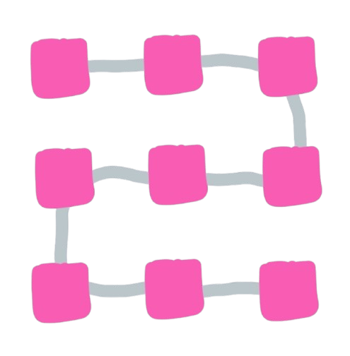

import NLevelAnalytics from '@site/src/components/NLevelAnalytics/index.tsx';

# Blockchain as a Data Structure in Chat Apps: A Novel Approach

<NLevelAnalytics />

Blockchain has emerged as a transformative force in the rapidly evolving technology landscape. It is primarily known for its role in cryptocurrencies, but its potential extends far beyond digital currencies. One innovative application of blockchain technology is its use as a data structure for decentralized and distributed applications, particularly chat applications. In this article, we explore the concept of using blockchain as a data structure within a chat app, examining its benefits, challenges, and potential impact on the future of decentralized communication.

{/* truncate */}

## Understanding Blockchain as a Data Structure

At its core, Blockchain is a chain of blocks containing a data set. The critical feature of blockchain is its ability to provide a secure, immutable, and transparent ledger of transactions or data entries. Traditionally, blockchains are employed in cryptocurrency systems to validate and record transactions. However, the underlying principles of blockchain — decentralization, immutability, and consensus — make it an intriguing candidate for other use cases, including data storage and synchronization in chat applications.

Our chat app is experimenting with using blockchain as a data structure to store and synchronize chat messages between peers. Unlike traditional blockchain implementations that involve mining and cryptocurrency, our approach focuses on leveraging blockchain technology purely for data storage and validation within the app. This experimentation is part of a broader investigation into creating a distributed and decentralized chat application.

## The Benefits of Using Blockchain for Chat Data

1. Decentralization and PeertoPeer Synchronization: One of the most significant advantages of using blockchain in a chat app is the decentralization of data storage. Instead of relying on a central server, messages are stored and synchronized across multiple peers in the network. This decentralization ensures that data is more resilient to single points of failure and can be accessed and validated by various participants, even if some peers are offline.
2. Enhanced Security and Privacy: Blockchain's immutability and cryptographic features enhance the security and privacy of chat messages. Since the blockchain is designed to prevent unauthorized modifications and provide a transparent record of all transactions, it becomes a secure method for storing and validating chat messages. Users can have greater confidence that their communication is protected from tampering or unauthorized access.
3. Scalability and Performance: Although blockchains are often criticized for their scalability issues, our implementation is designed to be lightweight and efficient. By operating entirely in JavaScript within the browser, the blockchain maintains a manageable size and performs well even with large volumes of data. Initial tests show that the blockchain can effectively handle the storage and synchronization of chat messages, providing a smooth user experience without significant performance degradation.
4. Local Data Storage without Cryptocurrency: One key distinction of our approach is the absence of cryptocurrency and associated incentives. The blockchain is used solely for local data storage and validation. This eliminates the need for mining or financial transactions, reducing complexity and focusing on the core functionality of data synchronization. Users can store messages, files, and images without concerns about transaction costs or cryptocurrency value fluctuations.
5. Flexibility and AutoGenerated Credentials: The blockchain implementation allows for flexible data handling and autogenerated credentials. Users do not need to manage setup processes, IDs, or passphrases manually. Instead, these elements are generated and  worked behind the scenes, simplifying the user experience while ensuring data security and accessibility.

## Challenges and Considerations

While using blockchain as a data structure offers several advantages, it has challenges. Here are some key considerations:

1. Data Integrity and Manipulation: Although the blockchain provides a secure and immutable ledger, it is crucial to address potential issues related to data manipulation. In a decentralized chat app, peers may be able to alter local data. However, since the blockchain serves as a reference for data consistency, manipulation is limited to individual devices and does not affect the network's overall integrity.
2. Performance Optimization: While the current implementation performs well, there is always room for optimization. Caching mechanisms and performance improvements can enhance the efficiency of data retrieval and synchronization. Future developments will optimize the blockchain's performance to handle larger datasets and more complex interactions.
3. User Experience and Adoption: As with any innovative technology, user experience and adoption are critical factors. Ensuring that the blockchain-based chat app is user-friendly and provides a seamless experience is essential for its success. Continuous feedback from users will guide improvements and refinements to the app's functionality and interface.

## The Future of Blockchain in Chat Applications

Exploring blockchain as a data structure for chat applications represents a promising step towards decentralized communication solutions. By leveraging blockchain's core principles, we aim to create a chat app that is resilient, secure, and user-centric. The experimental implementation serves as a proof of concept, showcasing the potential of blockchain technology in a non-cryptocurrency context.

As we continue developing and refining the application, we are excited about blockchain's possibilities for enhancing data synchronization, security, and decentralization. The ability to store and synchronize chat messages across multiple devices without relying on a central server opens new avenues for building distributed and resilient communication systems.

## Conclusion

Traditionally associated with cryptocurrencies, blockchain technology holds significant promise as a data structure for decentralized applications. In our chat app, we explore this potential by using blockchain to store and synchronize chat messages. The benefits of decentralization, enhanced security, and local data storage highlight the value of this approach. While challenges remain, ongoing experimentation and optimization will drive the development of a robust and innovative chat solution.

We invite you to explore our experimental implementation and share your thoughts on blockchain as a data structure. As we continue to push the boundaries of decentralized communication, we look forward to collaborating with the community and refining our approach to create a groundbreaking chat application.

## FAQs:

1. What is blockchain as a data structure?

Blockchain is a chain of data blocks linked to the previous one, providing a secure and immutable record of transactions or data entries. In the context of chat apps, it can be used to store and synchronize messages across peers.

2. How does blockchain improve chat app security?

Blockchain enhances security by providing an immutable and cryptographically secure ledger of messages. This prevents unauthorized modifications and ensures that data is consistently validated across peers.

3. Why use blockchain instead of a central server for chat data storage?

Blockchain decentralizes data storage, reducing reliance on a central server and increasing resilience to single points of failure. It also enables peer-to-peer synchronization and enhances privacy and security.

4. What are the challenges of using blockchain in chat applications?

Challenges include potential data manipulation by peers, performance optimization, and ensuring a user-friendly experience. Continuous development and optimization are needed to address these issues.

5. Can users manipulate the blockchain data in the chat app?

While the blockchain provides a secure reference for data consistency, peers may be able to alter local data. However, this does not affect the overall integrity of the blockchain network.
