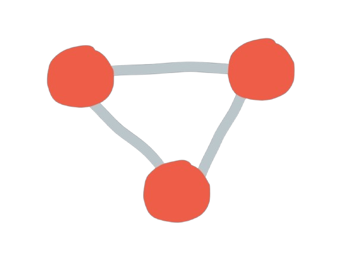
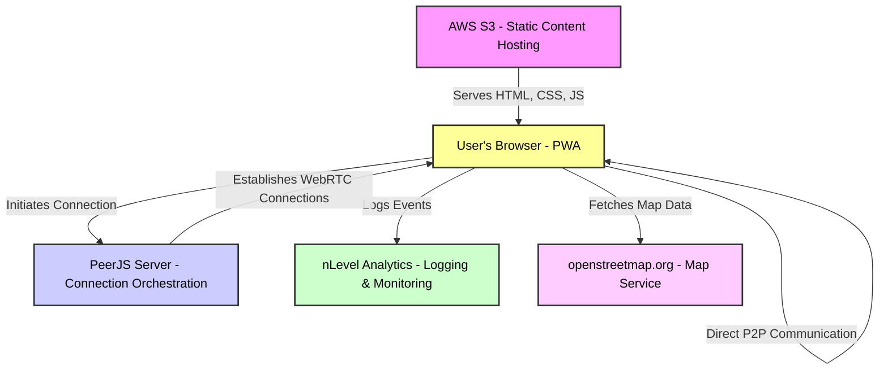
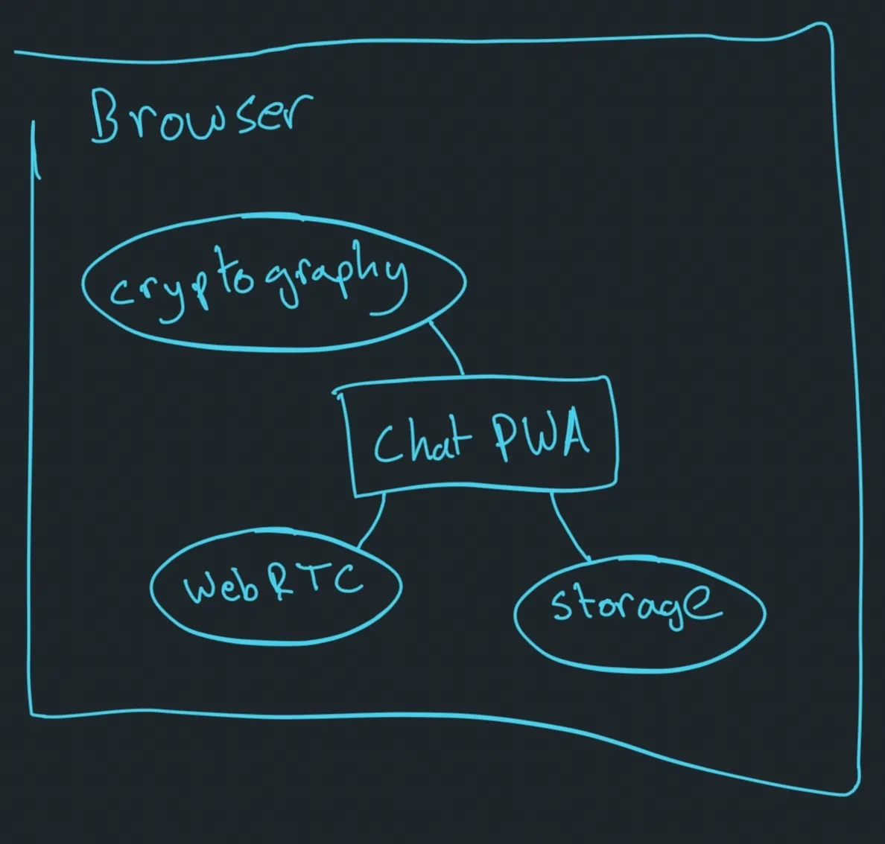
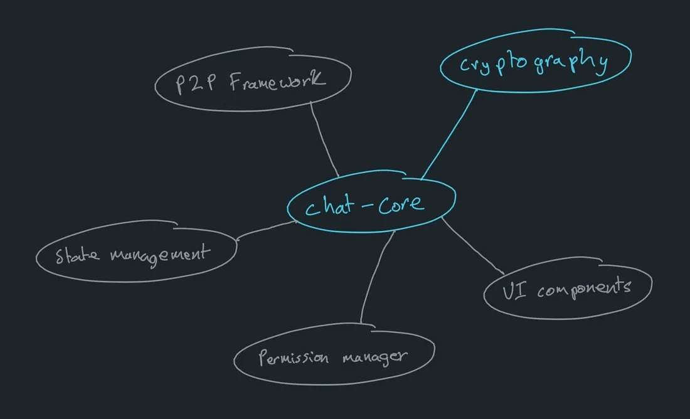
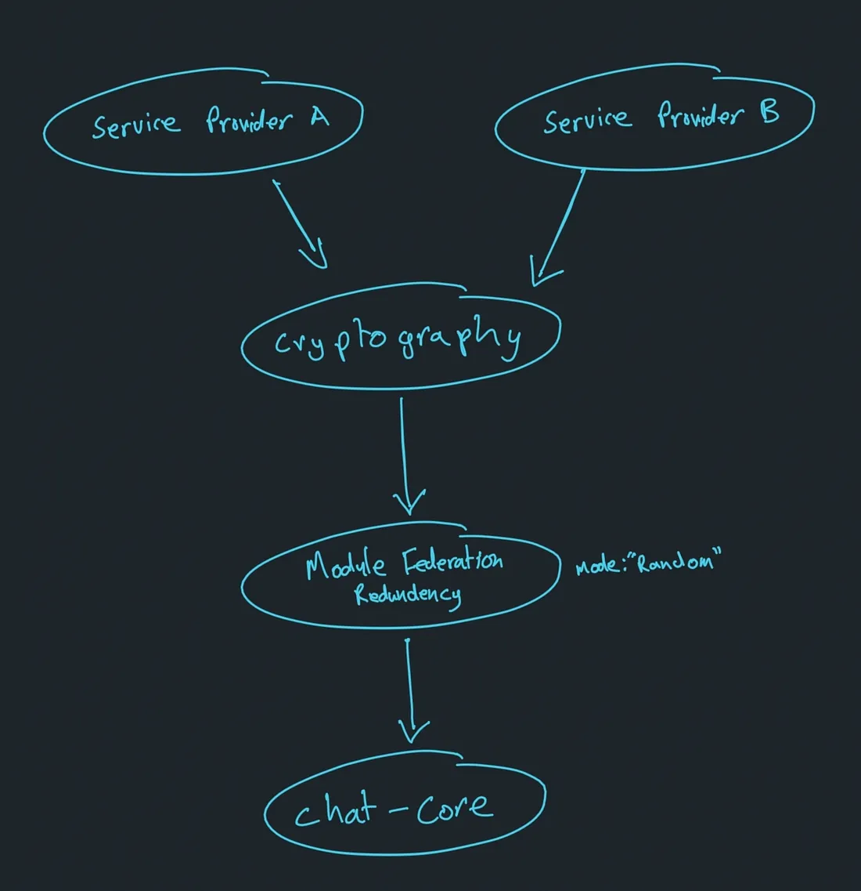
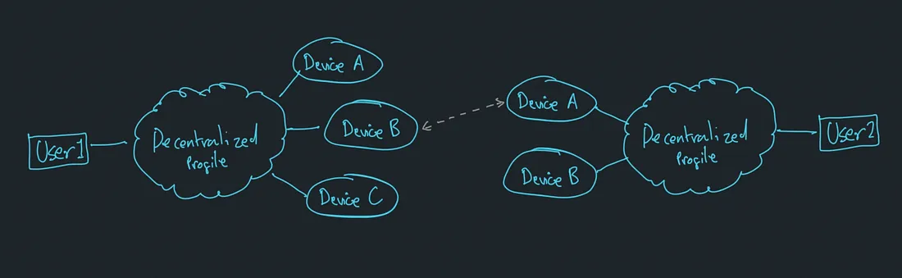
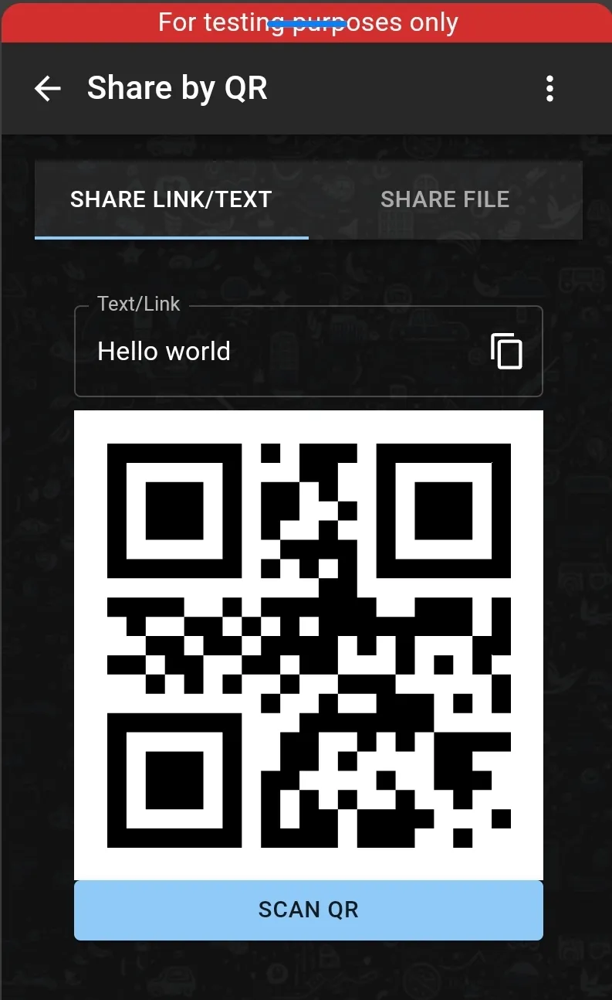

import NLevelAnalytics from '@site/src/components/NLevelAnalytics/index.tsx';

# Decentralized Microfrontend Architecture

<NLevelAnalytics />

In the ever-evolving landscape of digital communication, decentralization has emerged as a powerful concept with diverse interpretations and applications. This article explores our unique approach to decentralization in the context of a chat application, pushing the boundaries of what it means to be truly self-hosted and user-centric.

Our decentralized chat application reimagines the traditional centralized model by leveraging cutting-edge web technologies. Built as a Progressive Web App (PWA), it combines the best of both worlds - the accessibility of web applications and the rich functionality of native apps. What sets our approach apart is its commitment to operating independently of central servers, placing control firmly in the hands of users.

By prioritizing user privacy and data security, we've created an architecture that challenges conventional notions of chat applications. This article will take you on a deep dive into the innovative components and architectural decisions that form the backbone of our truly decentralized chat app, showcasing how we're redefining digital communication for the privacy-conscious era.

{/* truncate */}

# The Decentralized Chat App

An overview of how our chat application leverages Progressive Web App (PWA) technology to provide a seamless user experience across different devices and platforms.

## Data Storage and Networking

Our decentralized chat application takes a unique approach to data storage and networking, two critical components of any modern app. We've implemented innovative solutions that prioritize efficiency, security, and user privacy, setting our app apart from traditional centralized models. Let's explore how we handle these crucial aspects in a decentralized manner.

## Data Storage

Our app leverages IndexedDB for robust, client-side data storage directly in the browser. This choice offers several advantages over traditional options like cookies or local storage:

- **High Capacity**: IndexedDB can handle large volumes of data, far exceeding the limitations of other browser storage methods.
- **Complex Data Structures**: It supports storing and querying sophisticated data types, including files, blobs, and nested objects.
- **Asynchronous Operations**: IndexedDB's non-blocking, asynchronous API ensures smooth performance, even when dealing with substantial datasets.
- **Offline Functionality**: By storing data locally, our app can function without an internet connection, syncing changes when connectivity is restored.
- **Enhanced Privacy**: User data remains on their device, reducing exposure to potential breaches and unauthorized access.
- **Decentralized Architecture**: Local storage aligns with our goal of minimizing reliance on central servers, giving users more control over their data.

By utilizing IndexedDB, we create a foundation for a truly decentralized chat experience, where user privacy and data ownership are paramount.

## Networking

For networking, our app uses PeerJS-server as a connection broker to establish WebRTC connections between peers.

- **Direct Peer-to-Peer** : WebRTC, provided by the browser, enables real-time communication between peers. This allows two users to connect directly and exchange data with minimal latency.
- **Efficient Routing** : Once a connection is established, data is sent via the shortest possible network route, enhancing speed and efficiency.
- **Multiple Connections** : Browsers can handle multiple WebRTC connections simultaneously, though the number of connections can vary depending on the device and network capabilities.

PeerJS-server helps in the initial connection setup by acting as a signaling server. It facilitates the exchange of connection information between peers, enabling them to establish a direct WebRTC connection.

Our chat application achieves a high level of decentralization by utilizing two key technologies: IndexedDB for data storage and WebRTC with PeerJS-server for networking. This combination ensures that user data remains private and secure on their own devices, while enabling efficient and reliable peer-to-peer connections. By implementing these components, we're redefining what it means for an app to be truly self-hosted and decentralized, offering users unprecedented control over their data and communications.

# Static Distribution and Deployment

Our application is fundamentally a collection of static files, offering exceptional portability and ease of distribution. We utilize AWS services, specifically S3 for storage and CloudFormation for infrastructure management, to deploy our app. This approach ensures efficient distribution through a Content Delivery Network (CDN) spanning multiple AWS servers, optimizing accessibility and performance for users across different geographical locations.

## AWS S3 and CloudFormation

- **AWS S3** : We host our app on AWS S3, a scalable storage service that allows us to serve static files reliably. S3 ensures that our app is always available and can handle large numbers of requests without performance degradation.
- **CloudFormation** : By using AWS CloudFormation, we automate the deployment process, managing our infrastructure as code. This makes it easy to replicate and manage our app’s deployment environment.

Hosting on S3 and using CloudFormation means our app benefits from AWS’s global CDN. This ensures that our static files are cached and served from servers closest to our users, reducing latency and improving load times.

## Offline Availability and Self-Hosting

We go a step further by providing users with the option to download a zip file of the app directly from within the app. This ensures that users can run the app locally without relying on our servers.

- **Direct from Index.html** : Unlike some other apps, our app is a pure JavaScript implementation, designed to run directly from the index.html file. Users can simply open this file in their browser and start using the app without needing a server.
- **Docker Option** : For users who prefer or require a server setup, we offer a Docker configuration. This allows the app to be run in a containerized environment, providing flexibility and ease of deployment for different use cases.

## Unminified Code for Transparency

We believe in transparency and accessibility. Therefore, we run the app as unminified code. This has several advantages:

- **Ease of Download** : Users can download the entire app using simple browser commands like Ctrl/Cmd+S.
- **Transparency** : By providing unminified code, we ensure that users can inspect and understand the code they are running. This fosters trust and allows for easier customization and debugging.

By distributing our app as static files and offering multiple ways to run it, we ensure that users have maximum flexibility and control. Whether using AWS’s robust infrastructure or running the app locally, our approach embodies the principles of decentralization and user empowerment.

# Webpack 5 Module Federation

Our application harnesses the power of Webpack 5's Module Federation feature to implement a sophisticated microfrontend architecture. This innovative approach enables us to modularize our application into distinct, independently deployable units, significantly enhancing maintainability, development efficiency, and scalability. By breaking down the monolithic structure into smaller, more manageable pieces, we can develop and update different parts of the application independently, reducing complexity and potential conflicts.

This modular design not only streamlines our development process but also allows for greater flexibility in terms of technology choices and team autonomy. Each microfrontend can be developed, tested, and deployed independently, fostering a more agile development cycle.

We invite you to explore our open-source implementation and contribute to its evolution. You can find our frontend base repository [here](https://github.com/positive-intentions/frontend-base), which serves as the foundation for our modular architecture.

## Current Implementation

We have used Webpack 5 Module Federation to build the chat application, which you can find [here]([https://github.com/positive-intentions/chat](https://github.com/positive-intentions/chat)). Additionally, we have created a federated module for cryptography that can be imported at runtime, available [here]([https://github.com/positive-intentions/cryptography](https://github.com/positive-intentions/cryptography)). Our current setup is straightforward, allowing us to dynamically load different parts of the application as needed. This modular approach provides flexibility and efficiency in how we develop and deploy our app.

# Future Enhancements

We plan to further decompose the application into separate microfrontends, each responsible for a specific aspect of the app. This will not only simplify maintenance but also enhance documentation and development processes for individual components.

Planned Modules:

1. **UI Components** : A collection of reusable UI components that can be shared across different parts of the application, promoting consistency and reducing duplication.
2. **P2P Framework** : The core framework for peer-to-peer networking, facilitating real-time communication between users.
3. **State Management** : This module will manage the application’s state, ensuring efficient data handling and synchronization across different components and peers.
4. **Permission Manager** : A dedicated module for managing user permissions and access control, enhancing security and user management.

## Individual Storybooks and Module Exports

Each module will have its own Storybook and module export, providing a dedicated space for documentation, testing, and showcasing individual components. This approach will:

- **Enhance Documentation** : Each module will be well-documented, making it easier for developers to understand and use them.
- **Simplify Maintenance** : By isolating modules, we can update and maintain them independently, reducing the risk of breaking changes affecting the entire app.
- **Promote Reusability** : Well-defined modules can be reused across different projects, promoting a modular and efficient development approach.

By embracing Webpack 5 Module Federation and breaking down our app into distinct microfrontends, we aim to create a more robust, scalable, and maintainable architecture. This approach not only benefits our development process but also enhances the overall user experience by ensuring that each component is well-crafted and easily accessible.

# Redundancy and Reliability

In the past, we have encountered difficulties when deploying our app to AWS due to various technical issues. Given that our app functions as a self-hosted static application, we have started exploring alternative hosting options, such as GitHub Pages. You can view our deployment on GitHub Pages [here]([https://positive-intentions.github.io/chat](https://positive-intentions.github.io/chat)).

## GitHub Pages Deployment

Our microfrontend architecture allows us to deploy each module independently. This capability has enabled us to host copies of the app on GitHub Pages for each repository. While this approach is unconventional and can lead to redundant copies of the app, we believe it is a valuable exercise in exploring module federation redundancy.

- **Accessibility** : Hosting on GitHub Pages makes the app easily accessible to users and developers.
- **Simplicity** : GitHub Pages offers a straightforward deployment process, reducing the complexity often associated with other hosting solutions.
- **Cost-Effective** : GitHub Pages is free, making it an economical choice for hosting static sites.

## Redundancy and Interoperability

We aim to make our app interoperable across different hosting sources. By leveraging Webpack 5 Module Federation, we can ensure that the app works seamlessly whether it is served from AWS or GitHub Pages. This redundancy enhances the app’s reliability and availability.

- **Module Federation Redundancy** : We are investigating ways to make modules interoperable between different sources, ensuring that the app remains functional even if one source becomes unavailable. [Futher described here](http://positive-intentions.com/blog/statics-as-a-chat-app-infrastructure).
- **Interoperable Deployment** : Our goal is to allow the app to fetch and integrate modules from both AWS and GitHub Pages dynamically.

# Future Plans

To further enhance our deployment strategy, we plan to use a infrastructure as code tool, to deploy the app across multiple cloud service providers. This approach will increase the resilience of our deployment, ensuring the app remains online and functional even if one provider experiences downtime.

- **Multi-Cloud Deployment** : We can deploy the app to various cloud service providers, including AWS, Azure, and Google Cloud. This will distribute the app’s load and reduce the risk of a single point of failure.
- **Scalability** : This will enable us to scale the app easily across different providers, ensuring it can handle increased traffic without performance issues.
- **Cost Management** : Static file hosting is relatively a cheap option for hosting a webapp, we can optimize costs and ensure that the app remains affordable to maintain.

By exploring these new hosting options and implementing a robust deployment strategy, we aim to make our decentralized chat app more resilient, scalable, and cost-effective. Our efforts in redundancy and interoperability will ensure that the app continues to function seamlessly, providing a reliable user experience regardless of the hosting source.

## Multi-Device Architecture

As our app continues to develop, we are excited to introduce the concept of a decentralized profile that can be shared across multiple devices. This feature is designed for individuals who want to use the same profile on all their devices, providing a seamless and integrated multi-platform chat experience, much like any modern chat application.

## Decentralized Profile

A decentralized profile allows users to maintain a consistent identity and settings across different devices. This means that whether you are using a smartphone, tablet, or desktop, your profile can remain synchronized and up-to-date.

- **Profile Synchronization** : Users can access their chat history, contacts, and settings on any device by synchronizing their decentralized profile.
- **Data Consistency** : Changes made on one device are automatically reflected on others, ensuring a consistent experience.

## Multi-Platform Chat Experience

Implementing a decentralized profile enables us to offer a robust multi-platform chat experience. Users can switch between devices without losing their chat continuity or settings, enhancing the overall user experience.

- **Convenience** : Users can start a conversation on one device and continue it on another without any interruptions.
- **Flexibility** : The app adapts to various devices, providing a user-friendly interface and experience on each platform.

## Decentralized File Storage

In addition to profile synchronization, we are exploring the potential of decentralized file storage. This feature would allow users to move large files between devices quickly, easily and securely.

- **Cross-Device Sharing** : Users can share files between their devices effortlessly, whether they are transferring a document from their laptop to their phone or vice versa.
- **Collaborative Work** : Teams can collaborate more effectively by sharing encrypted files directly through the app, regardless of the devices they are using.

By introducing a decentralized profile and exploring decentralized file storage, we aim to enhance our app’s functionality and user experience. These features will provide users with the convenience and flexibility expected from a modern chat application while maintaining the principles of decentralization and security.

# Decentralized Peer Discovery

Decentralized peer discovery is a critical component of our app’s architecture. By leveraging innovative technologies such as QR codes, NFC, and BLE, we facilitate seamless connections between peers without relying on a central authority.

## QR Codes

QR codes provide a straightforward method for establishing peer connections. Users can generate a QR code that contains their connection details, which other users can scan to initiate a peer-to-peer connection.

- **Ease of Use** : Users can quickly and easily share connection details.
- **Security** : QR codes can be generated dynamically, reducing the risk of interception.

## NFC (Near Field Communication)

NFC allows devices to establish connections simply by being in close proximity. This technology is particularly useful for quick and secure peer discovery.

- **Speed** : Connections are established almost instantly.
- **Convenience** : Users can connect devices by simply bringing them close together, making it ideal for spontaneous interactions.

## BLE (Bluetooth Low Energy)

BLE enables devices to discover and communicate with each other over short distances with minimal power consumption. This makes it a suitable option for maintaining constant peer-to-peer connections.

- **Energy Efficiency** : BLE conserves battery life, making it ideal for mobile devices.
- **Range** : BLE provides a reliable connection over a short range, perfect for personal or localized networking.

## Combining Technologies for Enhanced Discovery

By integrating QR codes, NFC, and BLE, we create a robust and versatile peer discovery mechanism. Users can choose the most convenient method for their situation, ensuring that connections are both seamless and secure.

- **Hybrid Approach** : Users can combine different methods for an optimal connection experience. For instance, initial discovery via QR code followed by connection via BLE for sustained communication.
- **Adaptability** : The app adapts to the available technologies on the user’s device, providing the best possible peer discovery experience.

These innovative approaches to peer discovery, coupled with our decentralized microfrontend architecture, form the backbone of our commitment to enhancing decentralization, scalability, and user experience. By continually exploring and implementing cutting-edge technologies, we ensure our app remains at the forefront of decentralized communication solutions

These sections outline the key aspects of our decentralized microfrontend architecture and provide a roadmap for our ongoing and future efforts to enhance decentralization, scalability, and user experience.

# Conclusion

Our journey towards building a decentralized chat application has been driven by a desire to push the boundaries of what it means for an app to be truly self-hosted and independent of central servers. By leveraging modern web technologies such as Progressive Web Apps, IndexedDB, WebRTC, and Webpack 5 Module Federation, we have created a robust and scalable architecture that emphasizes privacy, security, and user empowerment.

We have explored innovative hosting solutions like GitHub Pages and plan to implement multi-cloud deployments to enhance resilience and scalability. Our vision for a multi-device architecture, incorporating decentralized profiles and encrypted file storage, aims to provide a seamless, cross-platform user experience. Additionally, our commitment to decentralized peer discovery using QR codes, NFC, and BLE ensures that users can connect easily and securely without relying on centralized authorities.

As we continue to develop and refine our app, we remain dedicated to the principles of decentralization, transparency, and user control. We invite you to join us on this journey, explore our open-source repositories, and contribute to the ongoing evolution of our decentralized chat application. Together, we can redefine what it means to communicate in a decentralized world.

Thank you for taking the time to read about our project. We look forward to your feedback and collaboration as we continue to innovate and improve our decentralized chat application.
