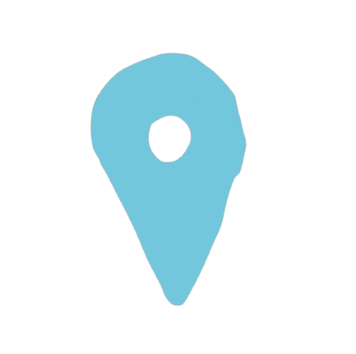

import NLevelAnalytics from '@site/src/components/NLevelAnalytics/index.tsx';

# Decentralized Location Sharing
<NLevelAnalytics />

In our ongoing efforts to enhance privacy and security in digital communication, we're excited to introduce a new feature to our decentralized chat application: decentralized location sharing.

{/* truncate */}

## How It Works

Our app leverages the geolocation capabilities built into modern web browsers to enable secure, peer-to-peer location sharing. Here's a breakdown of the process:

1. **Browser Geolocation**: We use the browser's Geolocation API to access the user's current location (with their permission, of course).

2. **WebRTC Data Channels**: The location data is then transmitted directly to peers using WebRTC data channels, ensuring end-to-end encryption and eliminating the need for a central server.

3. **User Control**: Users have full control over when and with whom they share their location, maintaining privacy and security.

## Key Features

- **Real-time Updates**: Share your location in real-time with selected peers.
- **End-to-End Encryption**: All location data is encrypted and sent directly between peers.
- **No Central Server**: Your location data never passes through our servers, enhancing privacy.
- **User Control**: Location sharing is always voluntary and users can control who they share their location with and when.

## Privacy and Security Considerations

While we've designed this feature with privacy in mind, it's important to remember:

- Only share your location with trusted contacts.
- Be aware of your surroundings and use discretion when sharing your location.
- Regularly review your location sharing settings.

## Future Enhancements

We're considering additional features to make location sharing even more useful and secure:

- Geofencing alerts
- Location history (stored locally only)
- Approximate location sharing (for enhanced privacy)

We're excited about the possibilities this new feature opens up for our users. Whether you're coordinating a meetup with friends or ensuring the safety of loved ones, decentralized location sharing adds a powerful new dimension to our chat application.

Try it out and let us know what you think! Your feedback is crucial as we continue to develop and refine this feature.