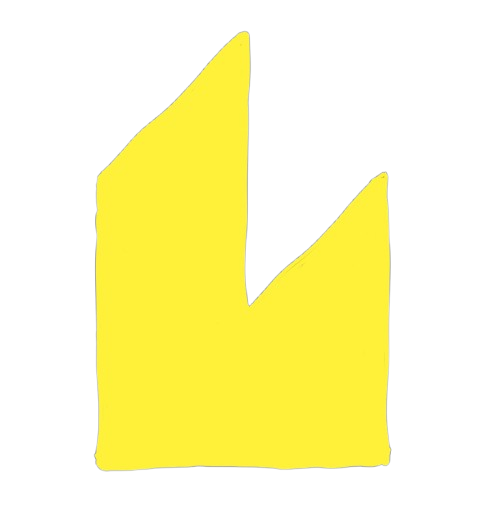

import NLevelAnalytics from "@site/src/components/NLevelAnalytics/index.tsx";

# Dim: Todo list With Functional Web Components

<NLevelAnalytics />

<center></center>

I'm working on creating something I can call "functional web components".

Following the [previous article](https://positive-intentions.com/blog/dim-functional-webcomponents) explaining how we can create functional web components, we have the basics to put together an app. I wanted to create a basic example of how it could be used and fix things along the way. The following is the result of that.

{/* truncate */}

A Todo list app is a good example of how to demonstrate the functionality of the library. We will create a todo list app using the functional web components we created in the previous article. We will use the hooks we created to manage the state of the todo list. We will create a todo list component that will render a list of todos. We will use what we created in the previous article to render the todo list.

<iframe
    src="https://dim.positive-intentions.com"
    style={{
        width: '100%',
        height: '500px'
    }}
></iframe>

---

## Refresher

Lets have a quick refresher of the functionality created in the previous article. If youre familiar with react, this should be familiar to you.

- `useState`: Is a hook that allows us to manage state in the component. It returns an array with the current state and a function to update the state. We can also pass an initial value to the state. It works similarly to React's `useState`.

- `useEffect`: Is a hook that allows us to run side effects in the component. It takes a function and an array of dependencies. If the dependencies change, the function will be called again. This is a way to run side effects in the component.

- `useStyle`: Is a hook that allows us to add styles to the component. It takes a CSS template literal and adds it to the shadow DOM of the component. This is a way to encapsulate styles to the component.

- `useMemo`: Is a hook that allows us to memoize the result of a function. It takes a function and an array of dependencies. If the dependencies change, the function will be called again. This is a way to optimize the rendering of the component.

- `useScope`: Is a hook that allows us to introduce components to the scope of the component. This is a way to share components between components.

- Rendering: Rendering is currently done using functionality provided by LitElement. It takes a template literal and renders the HTML to the component. It also creates watchers and event listeners for the template.

- `define()`: Is a function that allows us to define a web component. It takes an object with the tag name of the component, the functional component itself and any dependencies that should be shared down the component render tree.

Note: While we have props described in a similar way to react, dim functional components also have a second argument, which contains all the shared dependencies. This is being investigated to see if this is a funtional way of introducing shared dependencies to web components. This allows us to share state and other dependencies between components. (The theory is, by doing this, we can serialize functions to strings in a way that we can then use for something like vanillaJS module federation.)

---

## Todo List component

{/* lets create a todo list with functional web components. i will try to explain the implementation and decisions made as we go. We will use the hooks we created in the previous articles to manage the state of the todo list.

i will start creating the base todo list component. */}

Lets start by creating a simple todo list web component. We will create a todo list component that will render a list of todos. We will use what we created in the previous article to render the todo list.

We can start by creating a simple todo list component.

```javascript
import { html } from "./mini-lit.js";
import { define } from "./dim.ts";

const Todo = () => {
    return html`
      <div>
          <h1>Todo App</h1>
      </div>
    `;
};

define({ tag: "todo-app", component: Todo });

```

In this example we are creating a simple web component. We are rendering a div with an h1 tag. Using the `define` function we previsously created, we can set the tag-name of the component and the component itself. We need the `html` function to create the template for the component. The implementation is from [LitElement](https://lit.dev/docs/v1/lit-html/template-reference/).

---

## Input Form

Now lets create an input form to add todos to the list. We will use what we created in the previous article to manage the state of the input form.

```javascript
const AddItemForm = ({ onAdd }, { useState, useStyle, html, css }) => {
    console.log("AddItemForm", onAdd);
    const [inputValue, setInputValue] = useState("");

    useStyle(css`
        button {
        background-color: #029cfd;
        border: none;
        border-radius: 5px;
        color: white;
        padding: 5px 10px;
        text-align: center;
        text-decoration: none;
        display: inline-block;
        cursor: pointer;
        }
    `);

    const handleInput = (e) => {
        e.preventDefault();
        setInputValue(e.target.value);
    };

    const clearInput = () => {
        setInputValue("");
    };

    const addTodo = () => {
        onAdd(inputValue);
        clearInput();
    };

    return html`
    <input
        type="text"
        placeholder="Add todo"
        .value="${inputValue}"
        @change="${handleInput}"
    />
    <button @click="${addTodo}">Add</button>
    <button @click="${clearInput}">Clear</button>
  `;
};

export default AddItemForm;
```

In this example we are creating an input form to add todos to the list. We use the `useState` hook to manage the state of the input form and the `useStyle` hook to add styles to the component. We render an input field and two buttons. Event listeners are added to the input field and buttons to handle user input.

Lets add the `AddItemForm` into the todo list component. We can update the file like the following:

```javascript
import { html, css } from "./mini-lit.js";
import { define, useScope, useState, useStyle, useMemo } from "./dim.ts";
import AddItemForm from "./AddItemForm.js";

const Todo = ({}, {useState, useStyle, useMemo, html, css}) => {
    useScope({
      'add-item-form': AddItemForm
    })

    const [todos, setTodos] = useState([]);

    const numberOfTodoItems = useMemo(() => {
        console.log("memo calculation triggered");
        return todos.length;
    }, [todos]);

    const addTodo = (todo) => {
        setTodos([...todos, todo]);
    };

    return html`
      <div>
          <h1>Todo App</h1>
          <add-item-form .props="${{addTodo}}"></add-item-form>
          <p>Number of todo items: ${numberOfTodoItems}</p>
      </div>
    `;
};

define({
  tag: "todo-app",
  component: Todo,
  sharedDependencies: [useState, useStyle, useMemo, html, css],
});
```

Lets breakdown whats going on:

- Importing the hooks: We import the hooks we need to use in the component and pass it down in the `define` function to make it available for all sub components.

- useScope: This is a hook that allows us to introduce other dim components to the scope of the component. This is a way to create reusable web components.

- useMemo: This is a hook that allows us to memoize the result of a function. It takes a function and an array of dependencies. If the dependencies change, The function will be called again. This is a way to optimize the rendering of the component. In this example it is used to calculate the number of todo items. If the todos change, the function will be called again. in a "real-world" example, this could be used to do more heavier calculations.

- addTodo: A function that will add a todo to the list. It takes a todo as an argument and adds it to the list of todos. This should work like you would expect in ReactJS.

Note: We introduce the tag of the component we want to use in the scope of the component. It becomes available is use after configuring `useScope`. You will ntoice that we are passing the `addTodo` function as a prop inside an attribute `.props` to the `add-item-form` component. Web components do not allow for passing functions as props, so we have to pass it as an attribute and then use it inside the component. When using Dim you can pass a function as a prop by using the `.props` attribute. If we take a look at lit elements, it automatically creates watchers for the props as defined in its static property [as described here](https://lit.dev/docs/components/properties/). This means if we use props like normal, the component wont be able to listen for changes. For Dim, there is a property `.props` that will be used to watch for changes in the undelying implementation of lit elements. You should be able to use this for all use cases or you can fallback to the default Lit functionality for setting attributes. The value of the `props` object is then used to pass the values to the component.

---

## The Todo list

Now lets create a list of todos.

```javascript
import ListItem from "./ListItem.js";

const TodoList = ({ todos, onRemove }, { useScope, useEffect, html }) => {
    console.log("todo list render", todos);

    useScope({
        "list-item": ListItem,
    });

    useEffect(() => {
        console.log("todos list updated");
    }, [todos]);

    return html`
        <ul>
            ${todos.map((todo, index) => {
        const handleRemove = () => {
            onRemove(index);
        };

        return html`
                    <list-item
                        .props="${{ todo, onRemove: handleRemove }}"
                    ></list-item>
                `;
    })}
        </ul>
    `;
};

export default TodoList;
```

Lets break it down:

- `.props`: we are passing the todos and onRemove function as props to the component.

- `useScope`: This is a hook that allows us to introduce other dim components to the scope of the component. This is a way to create reusable web components.

- `useEffect`: This is a hook that allows us to run side effects in the component. It takes a function and an array of dependencies. If the dependencies change, the function will be called again. In this example, it is used to log when the todos change. 

- rendering: We are rendering a list of todos. We can use the Array map function to render a list of todos. We are also passing the todo and onRemove function as props to the `list-item` component. This is a way to pass data to the component. Notice that we are using the `.props` attribute to pass the props to the component.

---

## The Todo list item

Now lets create the todo list item.

```javascript
const ListItem = ({ todo, onRemove }, { useEffect, html }) => {
    useEffect(() => {
        console.log("List item mounted");
        return () => {
            console.log("List item unmounted");
        };
    }, []);

    return html`
    <li>
        ${todo}
        <button @click="${onRemove}">Remove</button>
    </li>
  `;
};

export default ListItem;
```

This component should now seem relatively simple, but lets break it down for clarity.

- `useEffect`: This is a hook that allows us to run side effects in the component. It takes a function and an array of dependencies. If the dependencies change, the function will be called again. In this example, it is used to log when the component is mounted and unmounted.

- rendering: We are rendering a list item with a todo and a button to remove the todo. An event listener is added to the button to handle the remove event. The onRemove function is called when the button is clicked. This is a way to pass data to the component.

---

## Putting it all together

Now lets introduce the todo list to the todo component.

```javascript
import { html, css } from "./mini-lit.js";
import { define, useScope, useState, useStyle, useMemo, useEffect } from "./dim.ts";
import AddItemForm from "./AddItemForm.js";
import TodoList from "./TodoList.js";

const Todo = ({}, { useState, useStyle, useMemo, html, css }) => {
    useScope({
        "add-item-form": AddItemForm,
        "todo-list": TodoList,
    });

    const [todos, setTodos] = useState([]);

    const numberOfTodoItems = useMemo(() => {
        console.log("memo calculation triggered");
        return todos.length;
    }, [todos]);

    const addTodo = (todo) => {
        setTodos([...todos, todo]);
    };

    const removeTodo = (index) => {
        setTodos(todos.filter((_, i) => i !== index));
    };

    return html`
    <div>
        <h1>Todo App</h1>
        <add-item-form .props="${{ addTodo }}"></add-item-form>
        <p>Number of todo items: ${numberOfTodoItems}</p>
        <todo-list .props="${{ todos, onRemove: removeTodo }}"></todo-list>
    </div>
  `;
};

define({
    tag: "todo-app",
    component: Todo,
    sharedDependencies: [useState, useStyle, useEffect, useMemo, html, css],
});
```

Lets break it down:

- rendering: We are rendering the todo list component. We pass the todos and onRemove function as props to the component. This is a way to pass data to the component. we also pass a function to remove a todo-item from the list.

- shared dependencies: its important to note the all the components down the tree will be able to use the hooks we define in the shared dependencies. you should note that useStyle and useEffect are in the dependencies, but unused in the todo component. you should take note of this when using the hooks in the components. Be sure to include the hooks you need if a component needs it to work correctly.

---

## Future considerations

- Remove all dependencies from Lit. It currently uses LitElement under-the-hood because of the convinient rendering, props, event listenders and state cacheing. I would like to see if we can create a similar functionality without the need for Lit. This would allow us to create a more lightweight library that can be used in any project.
- We can serialize functions to strings in a way that we can use them in vanillaJS module federation. This would allow us to create a more modular web application. I would also like to see if we can create a way to share dependencies between components in a more functional way. This would allow us to create more reusable components.
- Align the html template transformer to be more react like. this would be for things like supporting self-closing brackets, which web components do not support out-of-the-box.

---

## Conclusion

Im interested to hear what you think about this approach. I dont recomend using this approach to create any production ready applications. This is more of an experiment to see if we can create a more functional way of creating web components. I think its nearing a level for me to try refactoring some of my other work to use this approach. As i created the todo list, i found that it was a learning experience and i had to make some changes to the way. Im sure there are more changes that can be made to make it better. I would like to hear your thoughts on this approach and if you think it could be improved in any way.

- [Checkout the GitHub repository for the code](https://github.com/positive-intentions/dim)

- [There is a demo app you can try out](https://dim.positive-intentions.com)