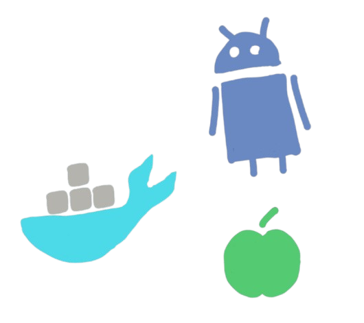

import NLevelAnalytics from '@site/src/components/NLevelAnalytics/index.tsx';

# How to Install and Run Your Decentralized Chat App Across Multiple Platforms

<NLevelAnalytics />

<center>

</center>

In today’s digital age, the importance of privacy and data security cannot be overstated. Our decentralized chat app aims to provide a secure and private messaging experience akin to popular applications like WhatsApp, but with a significant difference: decentralization. This design choice empowers users by giving them full control over their data, avoiding the pitfalls of centralized server based communication. While the app is not yet ready for official app stores, you can still install and run it on several platforms, including Docker, iOS, Android, and desktop systems. This guide will walk you through setting up the app across these platforms, providing a comprehensive overview for developers and tech enthusiasts.

{/* truncate */}


## Why Choose Docker for Running the App?

Docker is a powerful platform that simplifies the process of building, shipping, and running applications in isolated environments known as containers. Containers are lightweight and portable and ensure that your app runs consistently across different computing environments. This is particularly useful for applications like ours, where consistency and ease of deployment are crucial.

## Advantages of Docker:

1. Consistency Across Environments: Docker containers encapsulate the application and its dependencies, ensuring it behaves the same way in every environment. This eliminates issues related to differences in software versions and configurations.
2. Isolation: Docker containers provide isolation from the host system and other containers, reducing the risk of conflicts and ensuring that the app operates independently.
3. Portability: Docker images can be transferred between different systems, making it easy to deploy the app on various machines, including servers and desktops.

## Building and Running the App on Docker

To get started with Docker, you need to have it installed on your machine. You can download Docker from the [official website](https://www.docker.com/products/dockerdesktop) and follow the installation instructions for your operating system.

## Step 1: Build the Docker Image

Navigate to the root directory of your project and use the following command to build the Docker image:

```bash

npm run docker:build

```

Alternatively, you can use the direct Docker command:

```bash

docker build t chat f docker/Chat.Dockerfile . nocache

```

This command creates a Docker image named chat using the `Chat.Dockerfile` located in the `docker/` directory. The `nocache` option ensures a clean build by not using cached layers from previous builds.

## Step 2: Run the Docker Container

Once the image is built, run it using the following command:

```bash

npm run docker:run

```

Or, use the Docker command directly:

```bash

docker run name chatcontainer p 8080:80 chat

```

This command creates and runs a Docker container named chatcontainer, mapping port `8080` on your host machine to port `80` in the container. You can access the app via `http://localhost:8080` in your web browser.

## Building the App for Mobile: iOS and Android

To build the app for mobile platforms, we use [Capacitor.js](https://capacitorjs.com/), a cross platform native runtime designed to work with modern web technologies. Capacitor.js enables developers to build native applications for both iOS and Android from a single codebase.

## Why Use Capacitor.js?

1. Unified Codebase: Capacitor.js allows you to develop for both iOS and Android using a single codebase, saving time and effort.
2. Access to Native Features: It provides a consistent JavaScript API for accessing native device features like cameras, geolocation, and more.
3. Web Standards: Capacitor.js integrates seamlessly with modern web development tools and standards, making it a natural fit for web developers transitioning to mobile app development.

## Requirements:

iOS Development: Requires macOS with [Xcode](https://developer.apple.com/xcode/) installed.

Android Development: Requires [Android Studio](https://developer.android.com/studio) installed on your development machine.

## StepbyStep Guide to Building the App for iOS and Android:

1. Install Dependencies:

   Start by installing the necessary project dependencies:

   ```bash

   npm install

   ```

   This command ensures that all required packages are installed, which are defined in the `package.json` file.
2. Configure Capacitor:

   Create a Capacitor configuration file (`capacitor.config.json`) in the root directory. This file contains essential settings for your app:

   ```json

   {

     appId: com.example.chatapp,

     appName: ChatApp,

     webDir: build,

     bundledWebRuntime: false

   }

   ```

   Replace `appId` and `appName` with your app’s unique identifier and name. The `webDir` field points to the directory containing your app’s productionready web assets.
3. Build the Web Assets:

   Generate the web assets by running:

   ```bash

   npm run build

   ```

   This command creates a `build` directory with productionready files for your app.
4. Add Platforms:

   Use Capacitor to add the desired platforms:

   ```bash

   npx cap add ios

   npx cap add android

   ```

   These commands generate native iOS and Android projects in the `ios/` and `android/` directories, respectively.
5. Open in Native IDE:

   Open the generated native projects in Xcode or Android Studio:

   ```bash

   npx cap open ios

   npx cap open android

   ```

These commands will open the native projects in their respective IDEs, where you can configure additional settings and build the app for deployment.

6. Compile and Run:

Use Xcode or Android Studio to compile and run the app on a physical device or emulator. Ensure that you configure any required permissions and settings needed for your app to function correctly.

## Building the App for Desktop

For the desktop version of the app, we use [Tauri](https://tauri.app/), a framework designed for building lightweight, cross platform desktop applications using web technologies.

## Why Choose Tauri?

1. Small Binary Size: Tauri applications are known for their small binary size, which results in faster downloads and installations.
2. Security: Tauri provides a secure runtime environment, reducing the attack surface of your application.
3. CrossPlatform: Tauri allows you to build macOS, Windows, and Linux applications using the same web codebase.

## Requirements for Desktop Development:

Rust: Tauri requires Rust, a programming language to compile the app into a native binary. Install Rust from the [official website](https://www.rustlang.org/tools/install).

Node.js and npm: These tools manage project dependencies and build scripts.

## StepbyStep Guide to Building the App for Desktop:

1. Install Rust:

   Follow the instructions on the Rust website to install Rust:

   ```bash

   curl proto '=https' tlsv1.2 sSf https://sh.rustup.rs | sh

   ```

   This command installs Rust and its package manager, Cargo.
2. Install Project Dependencies:

   Install all necessary dependencies by running:

   ```bash

   npm install

   ```
3. Configure Tauri:

   Create a Tauri configuration file (`tauri.conf.json`) in the root directory. This file contains essential settings for the Tauri build process, including the app’s name and version.
4. Build the App:

   Generate the desktop application by running:

   ```bash

   npm run tauri build

   ```

   The build files will be located in the `tauri/target/release/bundle` directory. The output will vary depending on the target platform (e.g., `.app` for macOS, `.exe` for Windows).
5. Set Executable Permissions:

   On Unixbased systems, you might need to adjust the executable permissions of the build file:

   ```bash

   chmod +x <filename>

   ```
6. Run the Application:

You can run the built application by double clicking the executable file or running it from the command line.

## Conclusion

Deploying a decentralized chat app across multiple platforms requires a thorough understanding of various development tools and frameworks. Docker, Capacitor.js, and Tauri each offer unique advantages that simplify the process of building, running, and managing your app. Docker ensures consistency and portability, Capacitor.js enables cross platform mobile development, and Tauri provides a lightweight solution for desktop applications.

By following this guide, developers and tech enthusiasts can set up and experiment with the app locally, refine its features, and prepare it for future release. As the app evolves, these tools will facilitate a streamlined development process, ensuring that the final product meets the highest standards of performance and user experience.
