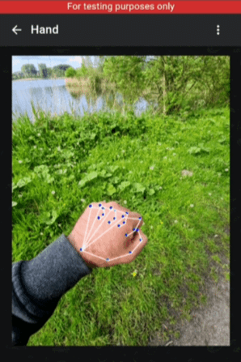

import NLevelAnalytics from '@site/src/components/NLevelAnalytics/index.tsx';

# P2P Video Calls in Virtual Reality: A New Frontier for Decentralized Communication

<NLevelAnalytics />

We are excited to announce a transformative new feature in our app: Decentralized PeertoPeer (P2P) Video Calls in Virtual Reality—directly within your browser. This feature represents a significant leap forward in enabling secure, immersive, and interactive communication experiences.

{/* truncate */}

## Building an Immersive 3D Environment

<iframe width="100%" height="315px" style={{maxWidth: '560px'}} src="https://www.youtube-nocookie.com/embed/8vYCwMg7T7E?si=Co455FOUz4zlgXYi" title="YouTube video player" frameborder="0" allow="accelerometer; autoplay; clipboard-write; encrypted-media; gyroscope; picture-in-picture; web-share" referrerpolicy="strict-origin-when-cross-origin" allowfullscreen></iframe>

### Exploring BabylonJS: The Core Technology Behind Our VR Feature

To bring this vision to life, our development team has worked extensively with BabylonJS, a powerful open-source 3D engine for rendering graphics in the browser. BabylonJS allows us to create highly detailed, visually rich environments that feel engaging and interactive. Although the current implementation is still in the early stages and somewhat unstable, the potential for this technology to redefine digital communication is enormous. Our team is committed to refining this feature continuously, optimizing performance, and enhancing user experience.

BabylonJS provides several advantages, such as compatibility with WebXR and WebGL, making it ideal for developing complex virtual environments that can run smoothly on various devices. Our choice to use BabylonJS was driven by its ability to handle sophisticated 3D scenes, manage physics-based interactions, and offer cross-platform support—all crucial for building a seamless VR experience.

### A Work in Progress: Challenges and Opportunities

This P2P VR feature is currently an unstable proof of concept, but it serves as a glimpse into the future of decentralized communication. Developing this technology has presented several challenges, such as managing latency during video calls, optimizing 3D graphics for different devices, and ensuring smooth user interactions. However, each challenge represents an opportunity to innovate and push the boundaries of what's possible in browser-based VR.

We are excited to share this initial version with you and invite feedback as we work to refine the experience further. Our goal is to create a feature that is not only functional but also enjoyable, immersive, and secure for all users.

### Experience It Yourself: Live and Testable Features

While the feature is still in development, several elements are already live and available for testing. At this stage, augmented reality (AR) is temporarily disabled for peer-to-peer calls due to current performance limitations. However, you can still navigate the environment using onscreen joystick controls or the WASD keys on your keyboard.

For now, our AR demo provides a solo experience where you can explore the virtual environment and test the core functionalities. In addition, you can initiate video calls to peers for testing purposes, allowing you to experience how these P2P calls work in a VR setting. This hands-on opportunity enables users to familiarize themselves with the new technology and provide valuable feedback to help shape its development.

<iframe width="100%" height="315px" style={{maxWidth: '560px'}} src="https://www.youtube-nocookie.com/embed/2gTTu4OqoiM?si=Co455FOUz4zlgXYi" title="YouTube video player" frameborder="0" allow="accelerometer; autoplay; clipboard-write; encrypted-media; gyroscope; picture-in-picture; web-share" referrerpolicy="strict-origin-when-cross-origin" allowfullscreen></iframe>

## Creating the Optimal Augmented Reality Experience

### How to Maximize Your AR Experience

To achieve the best AR experience, we recommend using a mobile phone in a flat, open outdoor space where you can move around freely. The open space allows for greater freedom of movement, enhancing the feeling of immersion in the virtual environment. Shortly, we plan to expand the 3D space further, introducing more detailed environments, interactive objects, and dynamic lighting to make the experience even more realistic and engaging.

### Current Environment Elements: What's Included?

The current version of our virtual environment is a starting point for what will become a much richer experience. You will find a "mirror cube" that captures input from your phone's camera, allowing you to see yourself within the virtual space. Additionally, floating, rotating cubes are included to enhance the aesthetic appeal and provide a sense of depth and dimension. As we continue development, we expect to see more 3D models, interactive elements, and environmental features that make the experience more dynamic and captivating.

### Expanding the Experience: Group Video Calls in AR

One of the most exciting features we are working on is support for group video calls in AR. This addition will enable multiple users to connect in a shared virtual space, creating new social interaction, collaboration, and entertainment possibilities. Imagine hosting virtual meetings, events, or hangouts where participants can see and interact with each other in a fully immersive environment. The potential for creativity, collaboration, and community building is vast.

### Why 3D and AR in Browsers Matter: A Vision for the Future

3D and AR technologies are rapidly gaining traction in the mainstream, from gaming and entertainment to education and professional applications. As these technologies become more prevalent, we believe that browsers should offer robust support to enable users to explore and engage with them fully. Our vision is to make virtual reality and augmented reality accessible to everyone without the need for expensive equipment or specialized software.

By integrating these capabilities into a browser-based platform, we are democratizing access to advanced communication tools and breaking down barriers to entry. This approach aligns with our commitment to decentralized technology, privacy, and user empowerment.

### Future Development: Hand Tracking in BrowserBased AR

A significant area of focus for future development is enhancing interactivity within the AR environment through hand tracking. Hand tracking allows users to interact with virtual objects more naturally and intuitively, opening up a new range of possibilities for AR applications.

## Try Our Hand Tracking Demo

We have created an experimental proof of concept demonstrating hand tracking within a browser-based AR environment. This demo uses TensorFlow and WebAssembly to achieve real-time 3D hand pose estimation, mapped to your webcam's image. The technology is designed to be lightweight and performant, providing a glimpse into the future of in-browser AR interaction.

While the demo is still a prototype, it showcases the potential for more complex and engaging interactions, such as selecting objects, performing gestures, or manipulating virtual elements.

## Next Steps in Our Development Journey

### Our development roadmap includes several exciting milestones:

1. Rigged 3D Hand Model: We plan to implement a rigged 3D hand model that will be positioned relative to the observed hand from the camera feed. This will provide a more lifelike representation of user movements.
2. Gesture Recognition: We are working on algorithms that recognise specific gestures, such as pointing, grabbing, or giving a thumbs up. This will enable a more interactive experience where users can perform meaningful actions within the virtual environment.
3. PeertoPeer Hand Position Sharing: A key aspect of enhancing our AR experience is enabling peer-to-peer hand position sharing. This feature will allow users' hand movements to be rendered on their peers' devices in real-time, facilitating collaborative activities and shared interactions in the virtual space.

While there is no fixed timeline for the release of these features, we are committed to continuous improvement and will keep our community updated on our progress.

### Why It Matters: The Future of Decentralized Communication

Our exploration of VR and AR technologies is not just about creating cool new features—it's about reimagining how people connect and communicate in a decentralized digital world. By integrating these technologies into our app, we are offering users a new way to experience presence and proximity, even when they are far apart. It also aligns with our core privacy, security, and user empowerment values.

### Stay Connected and Share Your Thoughts!

We're eager to hear your feedback and thoughts on these exciting developments. Your input is invaluable as we continue to innovate and refine our app. Stay up-to-date with the latest news by subscribing to our subreddit: [r/positive_intentions](https://positive-intentions.com).

## 5 FAQs

1. What are decentralized peer-to-peer (P2P) video calls in virtual reality?

Decentralized P2P video calls in VR allow users to make video calls in an immersive 3D environment directly from their browsers without centralized servers.

2. How can I test the new VR video call feature?

You can test the feature using our online AR demo, which allows solo experiences and peer calls using onscreen controls or keyboard keys.

3. Why is AR currently disabled for peer calls?

AR is temporarily disabled for peer calls due to performance issues, but we're optimizing this feature for a smoother experience.

4. What devices provide the best AR experience for this feature?

We recommend using a mobile phone in a flat, open outdoor space to maximize mobility and immersion.

5. What future features can we expect for the VR and AR environment?

Future updates include:

Hand tracking.

Gesture recognition.

Peer-to-peer hand position sharing.

Expanded group video call support in AR.
