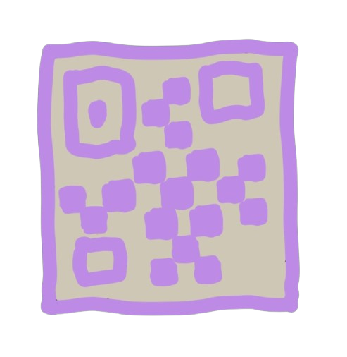

import NLevelAnalytics from '@site/src/components/NLevelAnalytics/index.tsx';

# QR Codes as a Data Channel

<NLevelAnalytics />

Explore the new "File Sharing by QR Code" feature in our decentralized chat app. Learn how we use JavaScript-based QR technology for offline data exchange and the innovative potential of this experimental approach.

{/* truncate */}

## Expanding Decentralized Functionalities

At [positiveintentions](https://chat.positiveintentions.com//qr), we’re constantly exploring new ways to enhance our decentralized chat app. Our mission is to push the boundaries of what is possible in a serverless, peer-to-peer (P2P) environment. Today, we are excited to introduce a new experimental feature: File Sharing by QR Code. This feature is designed to complement our app's decentralized functionalities and offer a unique way to share data securely and privately.

While this approach is still in the early stages and not the most practical for transferring large files, it opens up exciting possibilities for offline data exchange, especially in scenarios where conventional internet connectivity is unavailable or undesired. Even small, incremental innovations like this can contribute to the broader goal of achieving true decentralization.

## What is "File Sharing by QR Code"?

"File Sharing by QR Code" is an experimental proof-of-concept feature that allows users to share files by generating and scanning a series of QR codes. This method leverages JavaScript-based QR code reading and writing functionality, enabling data to be serialized, split into multiple parts, and encoded into QR codes.

Here’s how it works:

1. QR Code Generation: When a user selects a file to share, the app serializes the data and splits it into chunks that can each be encoded as a QR code.
2. Displaying QR Codes: The app then generates a series of QR codes that represent the chunks of the file. These codes are displayed sequentially on the screen.
3. QR Code Scanning: The receiving user scans all the QR codes using the app's built-in QR scanner.
4. Reconstructing the File: Once all the QR codes have been scanned, the app reconstructs the original file from the encoded data chunks.

While it may seem that there are more efficient ways to transfer files, this serves as an interesting exploration of offline file sharing in a decentralized environment.

## Technical Breakdown: How It Works

The "File Sharing by QR Code" feature is implemented using the following JavaScript libraries:

`react-qr-code`: This library generates QR codes in the app. It converts the serialized file data into a series of QR codes that can be displayed on the sender’s screen.

`react-qr-scanner`: This library enables the app to scan QR codes using the device’s camera. The scanned data is then captured and processed to reconstruct the original file.

The Process:

Serialization and Splitting: When a user imports a file into the app, JavaScript serializes the data into a string format. The serialized data is then split into chunks that are small enough to be encoded as individual QR codes.

QR Code Generation: Each chunk of data is converted into a QR code using the `react-qr-code` library. These QR codes are displayed one by one on the sender’s device.

QR Code Scanning and Reconstruction: The receiver scans each QR code using the `react-qr-scanner.` Once all the QR codes have been scanned, the app gathers the chunks and reconstructs the original file from memory.

## Potential Use Cases for QR Code File Sharing

While file sharing by QR code may not be practical for transferring large files (due to its slow speed and the need for manual scanning), it could have some interesting use cases, particularly in decentralized, offline, or low connectivity environments:

Exchanging WebRTC Connection Data Offline: One of the most promising applications is for exchanging WebRTC (Web RealTime Communication) connection data offline. This could be useful in situations where users want to establish a P2P connection without relying on any central servers or internet connectivity. For example, during events, meetings, or in areas with limited internet access, users could quickly exchange the necessary data to establish a secure WebRTC connection.

Sharing Small Files Securely: For small files, such as text snippets, contact information, or configuration settings, sharing via QR codes could be a fun and novel way to transfer data directly between two devices. This could be particularly appealing for privacy-conscious users who want to avoid using cloud services or other intermediaries.

Testing and Educational Purposes: This feature can be used as a proof of concept to demonstrate JavaScript's capabilities in building decentralized applications. It could also serve as a teaching tool for developers interested in learning more about P2P communication and decentralized app development.

## Limitations and Areas for Improvement

While the concept of file sharing by QR code is innovative, it’s important to recognize its current limitations:

Speed and Efficiency: The current implementation could be faster and more convenient, especially when transferring files larger than a few kilobytes. This is mainly due to the need for manually scanning multiple QR codes.

User Experience (UX): The process of generating and scanning multiple QR codes can be tedious, especially for non-technical users. The feature requires further development and refinement to improve usability and make it more practical for everyday use.

Data Size Constraints: QR codes have a limited data capacity. For files larger than 5KB, the number of QR codes required can become impractical, making the process cumbersome.

## How We Plan to Improve This Feature

We are committed to enhancing the "File Sharing by QR Code" feature to make it more practical and userfriendly. Here are some areas we are focusing on:

Optimizing QR Code Generation: We aim to optimize the serialization and QR code generation processes to reduce the number of QR codes required for each file. This could involve compressing the data or using more efficient encoding techniques.

Improving Scanning Speed: We are exploring ways to improve the speed and reliability of QR code scanning, such as using machine learning algorithms to enhance image recognition and error correction.

User Interface Enhancements: To make the process more intuitive, we plan to refine the user interface and provide clear instructions and feedback during the filesharing process.

Supporting Larger Files: We are investigating methods to handle larger files more effectively, such as combining QR code sharing with other offline transfer methods like Bluetooth or near-field communication (NFC).

## Seeking Community Feedback and Ideas

We believe in building our app in collaboration with our community. This experimental feature is just the beginning, and we are eager to hear from you!

How could this feature be more useful to you?

What improvements or additional functionalities would you like to see?

Your feedback is invaluable in helping us shape the future of this feature. Whether you think it’s a fun novelty or a tool with serious potential, we want to hear from you.

## Conclusion: Exploring the Boundaries of Decentralized Communication

"File Sharing by QR Code" is an innovative step in our journey to develop a fully decentralized chat app. While the feature is currently experimental and has its limitations, it demonstrates our commitment to exploring unconventional methods to achieve decentralization and user privacy.

We invite you to test this feature, share your thoughts, and contribute to its evolution. Your participation will help us refine and expand the capabilities of our app, moving closer to a truly decentralized communication tool.

## FAQs

1. What is the "File Sharing by QR Code" feature?

It is an experimental feature that allows users to share files by generating and scanning a series of QR codes, enabling offline data exchange without the need for internet connectivity.

2. How does it work?

The app serializes the file data, splits it into chunks, and converts each chunk into a QR code. The receiving user scans these QR codes to reconstruct the original file.

3. What are the current limitations?

The feature could be faster and more convenient for large files and requires further development to improve usability and efficiency.

4. What are the potential use cases?

It could be used for offline exchange of WebRTC connection data, sharing small files securely, or educational purposes.

5. How can I provide feedback or suggest improvements?

