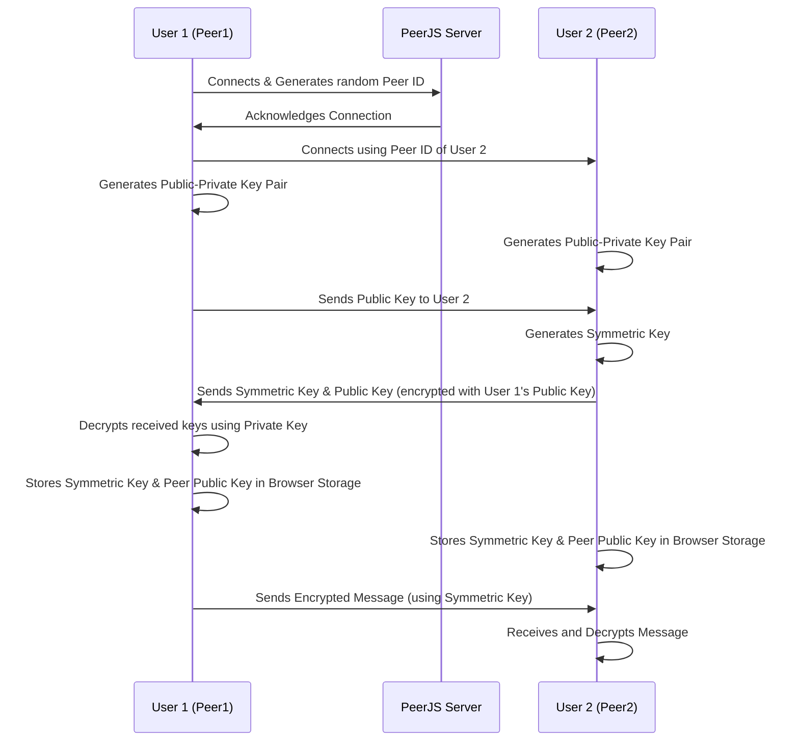

import NLevelAnalytics from '@site/src/components/NLevelAnalytics/index.tsx';

# positive-intentions Authentication: Safeguarding Your Interactions

<NLevelAnalytics />

At positive-intentions, our focus is on creating a secure, seamless, and user-friendly communication environment. Here's a deeper dive into how we achieve this with our unique authentication process.

## Authentication Sequence:

* **User 1 and User 2 (U1, U2)** : These are the peers in the chat application. Each starts by connecting to the PeerJS server and generating a random Peer ID.
* **PeerJS Server (PS)** : Facilitates the initial connection between peers but does not involve directly in the encryption key exchange.
* **Key Generation and Exchange** :
  * Both users generate their own public-private key pairs.
  * User 1 sends their public key to User 2.
  * User 2 generates a symmetric key for the session, encrypts it along with their public key using User 1's public key, and sends both back to User 1.
* **Key Storage** :
  * Both users store the symmetric key and the other peer’s public key in their browser's local storage (indexedDB).
* **Encrypted Communication** :
  * Messages are encrypted using the symmetric key before being sent over the WebRTC connection established via PeerJS.

## Peer-to-Peer Connection Establishment

With the help of PeerJS and peerjs-server, we establish direct, secure connections between users. Each connection is associated with a unique and random connection string or ID. This unique ID serves as a robust layer of security, as it's highly unguessable.

## Sharing Connection IDs Safely

Although the connection ID provides significant security, it needs to be shared between peers for establishing a connection. This could pose a risk if a peer's system is compromised. Hence, we recommend users to share their connection IDs only with those they trust. To enhance security, we've made it simple for users to change their connection IDs if they suspect a compromise.

## Enhancing Authentication

We are continuously working to reinforce our authentication system. One of our future plans includes implementing public and private key pairs for each user. This will serve as a verification measure in cases where a connection string changes. Besides, we aim to supplement the encryption provided by WebRTC by encrypting the complete data payload before it is sent across.

## Prioritizing User Safety

User safety is paramount to us. We understand that while our P2P architecture does not inherently enable user blocking, it's essential to empower users with control over their interactions. Consequently, we're devising a system where users can change their connection IDs, auto-connect to recognized peers, and exclude blocked ones. Furthermore, we are looking into ways for users to report inappropriate conduct. These safety features are a work in progress, and we're dedicated to finding the best solutions to maintain a secure and respectful environment for all.
