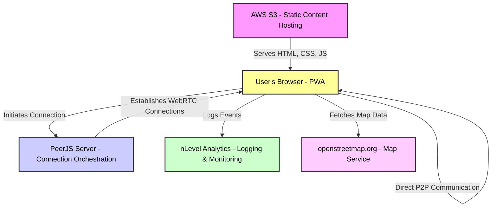

import NLevelAnalytics from '@site/src/components/NLevelAnalytics/index.tsx';

# Threat model

<NLevelAnalytics />

> ⚠️ **WARNING:** This document is not finished. The details in this document are subject to change.

## **Threat Model Document: Peer-to-Peer Chat Application**

### **Section 1: Identify and Categorize Assets**

In the context of the peer-to-peer chat application, the primary assets include both tangible and intangible components crucial for the app's functionality and the user's security and privacy. These assets are potential targets for threats and therefore require appropriate security measures.

### **1.1 User Data**

* **Messages** : Text and possibly media that are exchanged between users. These are transient but can be intercepted or logged by malicious actors during transmission or by exploiting client storage.
* **Encryption Keys** : Keys used for encrypting and decrypting messages. They are crucial for maintaining the confidentiality and integrity of the communications.
* **User Settings and Preferences** : Stored locally within the browser, these include any configuration options that the user can set within the app.

### **1.2 Infrastructure**

* **AWS S3** : Used for hosting the static content of the app, including HTML, CSS, and JavaScript files. It serves as the initial download point for users accessing the app.
* **PeerJS Server** : A third-party service utilized for orchestrating connections between peers. This server plays a critical role in the setup of peer-to-peer communication channels.
* **nLevel analytics** : Used for used for logging and monitoring user interactions with the application.
* **openstreetmap.org** : Used for displaying the map in the application.

### **1.3 Codebase and Dependencies**

* **React Application** : Built with Webpack, using React as the primary framework for the user interface.
* **PeerJS Library** : Manages the peer-to-peer interactions and is integral to the communication capabilities of the app.
* **Third-Party Libraries** : Various JavaScript libraries and frameworks included in the project, which could introduce vulnerabilities through external dependencies.

### **1.4 External Services**

* **AWS S3** : As mentioned, used for serving the static files necessary for the app’s operation.
* **Default PeerJS Server** : External service for peer connection management; potential vulnerabilities here could affect the overall security of the peer connections.
* **nLevel analytics** : External service for logging and monitoring user interactions with the application.
* **openstreetmap.org** : External service for displaying the map in the application.

### **1.5 Security Measures**

* **Content Security Policy (CSP)** : Implemented to restrict resources the browser can load, helping prevent XSS attacks and other injection vulnerabilities.

### **Section 2: Define Trust Boundaries**

In a peer-to-peer chat application, trust boundaries delineate areas where data crosses from a trusted to a less trusted or untrusted zone, or vice versa. These boundaries are critical for understanding and implementing security measures that control how data is accessed and used throughout the application.

### **2.1 External Networks**

* **Data Transmission Between Peers** : Since the application operates over the internet without a centralized server for data handling (except for connection management), the transmission path between any two peers represents a significant trust boundary. Data must be encrypted during transit to prevent interception by untrusted networks or third parties.

### **2.2 AWS S3 Hosting**

* **Static Content Delivery** : The static content (HTML, CSS, JavaScript files) hosted on AWS S3 is served to the client’s browser. The boundary here is between the AWS-hosted environment and the user’s device. While the static files themselves are not sensitive, any manipulation at this level (such as replacing the JavaScript files with malicious versions) could compromise the client-side of the application.

### **2.3 Third-Party Services**

* **PeerJS Server Interaction** : The application relies on the**`peerjs-server`** for orchestrating peer connections. This third-party service forms a trust boundary as it manages the signaling required for peers to find and connect with each other. Trust must be carefully managed here, particularly concerning how much control this service has over the connection setup and any data it might log or mishandle.

### **2.4 Browser Environment**

* **Client-Side Execution and Storage** : Any code execution and data storage that happen in the user’s browser are considered within a trusted boundary. However, the boundary is the browser itself, which interfaces with potentially untrusted data sources (e.g., input from other peers). Strong input validation and sandboxing techniques are necessary to maintain this as a secure zone.

### **2.5 User Data Interaction**

* **Input and Output of Data** : Every point where user data is entered (input fields) or displayed (message views) is a critical trust boundary. These areas are susceptible to attacks such as XSS if not properly handled. The application must ensure that all data displayed to or received from the users is sanitized to prevent script injections.

### **2.6 Device Level**

* **Local Storage and Processing** : Data stored locally on a user's device (e.g., encryption keys, chat history) and processing done by the app form a trust boundary against the device's other applications and systems. Ensuring data is stored securely and that the app has the necessary permissions isolated from other applications is crucial.

### **Section 3: Identify Entry Points**

Entry points are interfaces through which data enters the system or where significant interactions occur. Identifying these helps in understanding potential attack vectors and in designing effective security controls.

### **3.1 Browser-Based Client Interface**

* **User Interface Interactions** : Every interaction the user has with the application's interface, including message input fields, settings configurations, and any other forms of data entry. These are critical entry points for data validation and sanitization to prevent injection attacks.

### **3.2 Network Communications**

* **Peer-to-Peer Data Exchange** : This is the primary method of communication within the app, where messages and possibly media files are exchanged directly between peers. This communication needs robust encryption to secure data against eavesdropping and tampering.
* **Signaling for Peer Connection Setup** : Handled by the**`peerjs-server`** , this includes the exchange of IP addresses, session descriptions, and any other signaling data necessary to establish a peer-to-peer connection. Ensuring the integrity and confidentiality of this exchanged data is paramount.

### **3.3 Third-Party Integrations**

* **AWS S3** : The entry point for the app's static resources like HTML, CSS, and JavaScript files. Integrity checks must be in place to ensure these files are not tampered with in transit.
* **PeerJS Server API** : Interactions with the PeerJS server API for managing peer sessions and connections. Authentication and authorization mechanisms must be robust to prevent unauthorized access and manipulation of session data.

### **3.4 Application Code Execution**

* **JavaScript Execution** : As a single-page application built using React, the execution of JavaScript code is a significant entry point that must be secured against various client-side vulnerabilities, including cross-site scripting (XSS) and cross-site request forgery (CSRF).

### **3.5 Local Storage Access**

* **Browser Storage** : The application stores configuration settings and potentially sensitive encryption keys in local storage. Ensuring secure storage and access practices are in place is necessary to prevent access by malicious scripts or cross-origin requests.

### **3.6 External Data Inputs**

* **User-generated Content** : Any content generated by users, including messages and file transfers, can be an entry point for malicious data. Implementing content validation and proper handling of file types and sizes is crucial to maintain application security.

### **Section 4: Identify Threat Agents**

Threat agents are entities or forces that can potentially cause harm to the system by exploiting vulnerabilities. In the context of your application, these can range from individual hackers to automated scripts, each with varying levels of skill, motive, and resources.

### **4.1 Network Interceptors**

* **Passive Eavesdroppers** : These agents are capable of intercepting communications between peers. They may attempt to capture sensitive data transmitted over the network, particularly if messages are not adequately encrypted.
* **Active Man-in-the-Middle (MitM) Attackers** : More aggressive than passive eavesdroppers, these attackers actively insert themselves into the communication channel to intercept, modify, or redirect data.

### **4.2 Malicious Peers**

* **Rogue Users within the System** : Users who are part of the network but have malicious intentions. They could attempt to exploit vulnerabilities in the peer-to-peer communication protocol or the application's handling of data to inject malware or perform other harmful actions.
* **Spoofed or Impersonated Users** : These threat agents fake their identities to gain unauthorized access to the system or to deceive other legitimate users.

### **4.3 Third-Party Service Compromise**

* **Compromised External Services** : Since your application relies on**`peerjs-server`** , any compromise of this third-party service could pose a significant threat to the integrity and availability of your peer connections.

### **4.4 Automated Scripts and Bots**

* **Spam Bots** : Automated systems designed to flood the network with unwanted or malicious content, potentially leading to denial-of-service conditions or the spread of harmful links and software.
* **Scraping Bots** : Automated tools that attempt to harvest data from the application, potentially breaching privacy or extracting valuable information without consent.

### **4.5 Insider Threats**

* **Disgruntled or Negligent Employees** : If any part of your infrastructure or development team becomes malicious or careless, they could potentially misuse their access to sensitive areas of the application or its data.

### **4.6 External Hackers**

* **Opportunistic Hackers** : Attackers who look for easy targets with known vulnerabilities. They might not specifically target your application but could exploit it if they find easily exploitable weaknesses.
* **Targeted Attacks** : More sophisticated and resourceful attackers who specifically target your application possibly for financial gain, to steal intellectual property, or to cause reputational damage.

### **Section 5: Map Out Potential Vulnerabilities**

This section categorizes and describes potential vulnerabilities within the application. It examines how these vulnerabilities could be exploited by threat agents and assesses their potential impact on the application's security and functionality.

### **5.1 Data Interception and Manipulation**

* **Unencrypted Data Transmission** : Despite using peer-to-peer technology, if data is not encrypted or if encryption is improperly implemented, it can be susceptible to interception by network interceptors or malicious peers.
* **Man-in-the-Middle Attacks** : Vulnerabilities in the initial handshake or session setup with the**`peerjs-server`** could allow attackers to intercept or alter data before it reaches its intended recipient.

### **5.2 Client-Side Security**

* **Cross-Site Scripting (XSS)** : Since the application is browser-based, it is vulnerable to XSS attacks if user input is not properly sanitized before being rendered on other users’ devices.
* **Cross-Site Request Forgery (CSRF)** : Lack of proper CSRF protections could allow unauthorized actions to be performed on behalf of a logged-in user by malicious websites.

### **5.3 Authentication and Authorization Flaws**

* **Impersonation/Spoofing** : Without robust authentication measures, malicious users could impersonate other users, potentially leading to unauthorized access to sensitive functions or information.
* **Insecure Storage of Encryption Keys** : If encryption keys are stored insecurely within the browser, they could be accessed by other applications or scripts, compromising the security of communications.

### **5.4 Dependency and Third-Party Risks**

* **Vulnerabilities in Third-Party Libraries** : The application relies on several third-party libraries and frameworks. Vulnerabilities in these components could be exploited to attack the application.
* **PeerJS Server Vulnerabilities** : Dependence on the**`peerjs-server`** introduces a risk if this third-party service has security flaws or is compromised.

### **5.5 Denial of Service (DoS)**

* **Resource Exhaustion** : Malicious peers or bots might attempt to flood the system with excessive connection requests or large volumes of data, overwhelming the application and preventing legitimate use.

### **5.6 Code Execution Vulnerabilities**

* **Remote Code Execution** : Flaws in how the application handles data processing might allow an attacker to execute arbitrary code on the client’s device.
* **Local Code Exploitation** : Vulnerabilities within the app’s local environment, such as buffer overflows or insecure API usage, could allow local code execution or escalation of privileges.

### **Section 6: Propose Mitigations**

This section details mitigation strategies for the vulnerabilities identified previously. It aims to strengthen the application’s defenses, ensure the security of user data, and maintain the integrity and availability of the application’s services.

### **6.1 Mitigations for Data Interception and Manipulation**

* **End-to-End Encryption** : Implement robust end-to-end encryption for all data exchanged between peers to prevent unauthorized access and ensure data privacy. Use strong, well-vetted cryptographic protocols and ensure keys are exchanged securely.
* **Secure Connection Setup** : Strengthen the security of the initial connection setup with the**`peerjs-server`** by implementing mutual TLS or similar technologies to mitigate the risk of man-in-the-middle attacks.
* **Cryptographically random IDs** : Use cryptographically random IDs for peer connections to prevent attackers from guessing or brute-forcing connection IDs.

### **6.2 Mitigations for Client-Side Security**

* **Input Sanitization** : Implement comprehensive input validation and sanitization on both client and server sides to prevent XSS attacks. Use frameworks and libraries that automatically escape XSS by design.
* **Implement CSRF Protections** : Use anti-CSRF tokens for all state-changing operations within the application to prevent CSRF attacks.
* **Disposable profile** : Implement a disposable profile feature that allows users to create temporary profiles for one-time conversations, reducing the risk of spam bots.

### **6.3 Mitigations for Authentication and Authorization Flaws**

* **Strong Authentication Mechanisms** : Enhance user authentication by integrating multi-factor authentication (MFA) where feasible. Ensure all authentication activities are logged and monitored.
* **Secure Key Management** : Use secure browser storage mechanisms like the Web Cryptography API for storing encryption keys, and ensure keys are encrypted at rest.

### **6.4 Mitigations for Dependency and Third-Party Risks**

* **Regular Dependency Audits** : Conduct regular security audits of the codebase and update third-party libraries and frameworks to their latest secure versions. Utilize tools like Snyk or Dependabot for automated vulnerability scanning and updates.
* **Alternative to PeerJS Server** : Consider hosting your own instance of a peer connection management server, where you have full control over security settings and updates, to mitigate risks associated with third-party services.

### **6.5 Mitigations for Denial of Service (DoS)**

* **Rate Limiting** : Implement rate limiting on incoming requests to prevent abuse and mitigate the impact of DoS attacks. Consider using a service like Cloudflare to provide additional protections against large-scale DDoS attacks.
* **Resource Management** : Employ resource quotas and caps to prevent any single user from consuming excessive system resources.
* **cryptographically random IDs** : Use cryptographically random IDs for peer connections to prevent attackers from guessing or brute-forcing connection IDs.
* **Disposable profile** : Implement a disposable profile feature that allows users to create temporary profiles for one-time conversations, reducing the risk of spam bots.

### **6.6 Mitigations for Code Execution Vulnerabilities**

* **Security Hardening** : Harden the application against remote code execution by employing strict Content Security Policies (CSP) that restrict the sources of executable scripts.
* **Code Security Reviews and Static Analysis** : Regularly perform code reviews and use static analysis tools to detect and remediate security vulnerabilities in the application’s codebase.

### **Section 7: Review and Testing**

This section describes the approach to continuously assessing the security of the application, including the tools and techniques used for security testing, the frequency of security audits, and the processes for addressing and rectifying identified security issues.

### **7.1 Security Audits**

* **Regular Security Audits** : Schedule and conduct regular security audits to review the application’s compliance with security policies and best practices. These audits should involve both automated tools and manual inspection by security experts.
* **Third-Party Security Assessments** : Engage external security firms to perform periodic independent security assessments and penetration testing. This helps to provide an unbiased review of the application’s security posture.

### **7.2 Penetration Testing**

* **Regular Penetration Tests** : Conduct regular penetration tests to actively exploit vulnerabilities in the application, with the aim of identifying weaknesses not caught during the development or deployment phases.
* **Scenario-Based Testing** : Focus on specific scenarios based on real-world attack patterns and user behaviors to ensure the application can resist sophisticated attacks.

### **7.3 Continuous Integration and Deployment (CI/CD) Security Practices**

* **Integration of Security into CI/CD Pipelines** : Integrate security tools into the CI/CD pipelines to automatically scan for vulnerabilities in code and dependencies at every build. Tools like static application security testing (SAST) and dynamic application security testing (DAST) should be part of this integration.
* **Automated Security Regression Testing** : Implement automated tests that check for regressions in security features as part of the deployment process.

### **7.4 User Feedback and Incident Reporting**

* **User Feedback Loop** : Establish a secure and easy-to-use mechanism for users to report security concerns and feedback. This input should be regularly reviewed and used to inform security improvements.
* **Incident Response Plan** : Develop and maintain a comprehensive incident response plan that outlines procedures to be followed in the event of a security breach. This plan should include steps for containment, investigation, remediation, and communication with affected parties.

### **7.5 Training and Awareness**

* **Security Training for Developers** : Regularly train developers on secure coding practices and new security trends or threats. Encourage participation in security conferences and workshops.
* **Security Awareness for Users** : Provide users with guidance on security best practices related to the use of the application, especially on how to handle sensitive data securely.

### **7.6 Monitoring and Response**

* **Real-Time Monitoring** : Implement real-time monitoring tools to detect abnormal activities indicative of a security breach. This system should provide alerts to the security team for immediate action.
* **Continuous Security Improvement** : Maintain a cycle of continuous improvement based on the outcomes of audits, tests, user feedback, and monitoring. Update the security practices, tools, and training programs based on the latest security trends and incident learnings.

### **Section 8: Documentation and Response**

This final section of the threat model document focuses on maintaining comprehensive documentation of security measures and incident responses, as well as detailing the strategies for handling security incidents efficiently and effectively.

### **8.1 Documentation of Security Measures**

* **Maintaining Documentation** : Keep detailed documentation of all security policies, procedures, and configurations. This documentation should include descriptions of the security architecture, data flow diagrams, and details of implemented security controls.
* **Version Control** : Use version control systems to manage changes to security documents, ensuring that historical data can be referenced and that changes are tracked over time.
* **Accessibility** : Ensure that security documentation is easily accessible to all relevant parties while maintaining strict access controls to protect sensitive information.

### **8.2 Incident Response Plan**

* **Comprehensive Incident Response Plan** : Develop a comprehensive incident response plan that includes identification, containment, eradication, recovery, and post-incident analysis phases. This plan should be reviewed and updated regularly to adapt to new threats.
* **Roles and Responsibilities** : Clearly define the roles and responsibilities of all team members involved in incident response. Ensure that all team members understand their tasks and the procedures to follow during a security incident.
* **Communication Plan** : Include a communication plan that outlines how to notify internal stakeholders and, if necessary, external parties such as users, regulatory bodies, and the public. The plan should specify the channels of communication, messaging templates, and timing for disclosures.

### **8.3 Security Incident Documentation**

* **Incident Log** : Maintain a detailed log of all identified security incidents, including the nature of the incident, how it was detected, the response actions taken, and the outcome of the response.
* **Lessons Learned** : After resolving each incident, conduct a post-mortem analysis to determine what went wrong and why. Document lessons learned and use this information to strengthen future security measures and response strategies.

### **8.4 Regular Review and Testing of the Incident Response Plan**

* **Regular Drills** : Conduct regular drills to test the incident response plan and ensure that all team members are familiar with their roles during an incident. These drills should help identify any gaps or inefficiencies in the response procedures.
* **Continuous Improvement** : Use the insights gained from drills and actual incident responses to continuously improve the incident response plan. Adjust the plan based on evolving threats and organizational changes.

### **8.5 Legal and Regulatory Compliance**

* **Compliance Documentation** : Ensure that all security measures and incident response procedures are in compliance with relevant laws and regulations. Maintain documentation that can demonstrate compliance during audits or legal inquiries.
* **Regular Review of Compliance Status** : Regularly review the application’s compliance status with respect to new or updated regulations and adjust security practices accordingly to maintain legal and regulatory compliance.

